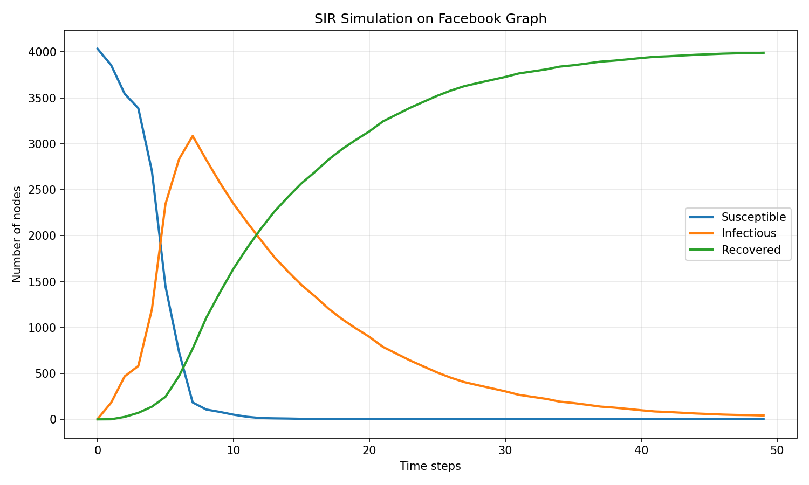
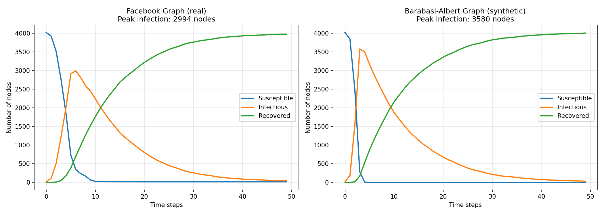
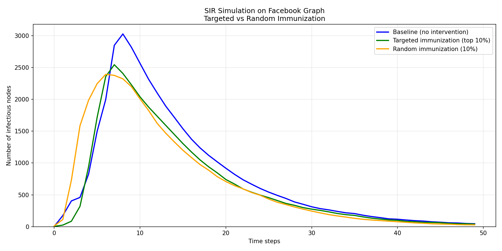

# How Network Topology Shapes Epidemics: A Graph SIR Simulation

## The Question

Intuitively, we know that some social networks spread things faster than others. A rumor flies through Twitter differently than it does through a small town's gossip chain. But can we measure this difference? And more importantly, can we predict which networks are most vulnerable before an outbreak happens?

This project answers that question by simulating disease spread on two fundamentally different network structures: a real Facebook social graph (dense with friend clusters) and a synthetic Barabasi-Albert graph (dominated by a few highly-connected hubs).

## How the Simulation Works

The SIR model tracks three states per node: **Susceptible** (healthy but can catch the disease), **Infectious** (actively spreading), and **Recovered** (immune). At each time step:

1. Every Infectious node attempts to infect its neighbors with probability β = 0.3
2. Every Infectious node recovers with probability γ = 0.1
3. The simulation runs until no Infectious nodes remain

The key engineering choice is representing the graph as a **sparse adjacency matrix** (CSR format). This allows the simulation to scale to graphs with millions of edges without the memory explosion of a dense matrix (which would be O(n²) and impossible at this scale).

## The Two Networks Compared

**Facebook (Real):** 4,039 nodes, 88,234 edges. This is anonymized Facebook friendship data from 2009 - a genuine social network with high clustering, meaning your friends tend to know each other. It has many "friend groups" but relatively weak hub dominance.

**Barabasi-Albert (Synthetic):** 4,039 nodes, 40,290 edges. This graph is built by preferential attachment - new nodes connect to existing nodes proportional to their current degree. The result is a "rich-get-richer" topology where a small number of hubs dominate the connectivity, resembling networks like the early internet or airline routes.

## The Results

### Facebook SIR Curve


The Facebook epidemic rises gradually, peaking around day 6 with 2,994 infections (74% of the population). Notice the bumpy, irregular shape - this reflects the cluster-based nature of the network. The disease spreads quickly within friend groups, pauses at the bridges between groups, then jumps to the next cluster.

### Facebook vs Barabasi-Albert Comparison


| Metric | Facebook (Real) | Barabasi-Albert (Synthetic) |
|--------|-----------------|-----------------------------|
| Time to peak | Step 6 | Step 3 |
| Peak infection | 2,994 nodes (74%) | 3,580 nodes (89%) |
| Curve shape | Gradual, bumpy, long tail | Sharp spike, smooth, rapid decline |

The Barabasi-Albert graph reaches its peak twice as fast and infects 15% more people. The explanation lies in the hub structure: once a hub gets infected (which happens quickly because hubs connect to many nodes), the disease reaches the entire network almost instantly. The Facebook graph's friend groups act as natural firewalls, creating hesitation at the network's bottlenecks.

## Immunization Strategies: Targeted vs Random

To test intervention effectiveness, I simulated two strategies on the Facebook graph:

- **Targeted immunization:** Remove the top 10% of nodes by degree (the most connected people, or "superspreaders")
- **Random immunization:** Remove 10% of nodes at random

### Targeted vs Random Immunization


The results challenge conventional wisdom:

| Strategy | Peak Infection | Nodes Removed | Edges Removed | Initial Delay |
|----------|---------------|---------------|---------------|----------------|
| Baseline | 3,029 | 0 | 0 | No |
| Targeted | 2,545 | 404 | 87,724 | Yes (flat start) |
| Random | 2,394 | 403 | 33,006 | No |

Random immunization actually performed slightly better, despite removing only 38% as many edges. Why?

The Facebook graph consists of dense, highly-connected clusters with sparse connections between them. Targeted immunization removes the bridges between clusters but leaves each cluster's internal structure intact. Once the disease enters a cluster (which eventually happens through remaining connections), it spreads rapidly through that dense subgraph.

Random immunization, by contrast, removes nodes from every cluster. This fragments the internal structure of each friend group, reducing spread everywhere simultaneously. The disease never finds an intact cluster to exploit.

This finding has practical implications: for highly clustered networks like social media platforms or office floor plans, random vaccination campaigns may outperform targeted hub-focused strategies. The conventional wisdom about "target superspreaders" assumes a network dominated by hubs. When the network is instead dominated by clusters, a different approach works better.

## What This Means in Practice

Network topology isn't an academic abstraction. It determines:

1. **Outbreak speed:** Hub-dominated networks explode instantly; clustered networks burn slowly
2. **Intervention strategy:** Target hubs for hub-dominated networks; vaccinate broadly for clustered networks
3. **Prediction power:** The spectral radius (largest eigenvalue of the adjacency matrix) predicts the epidemic threshold - the critical β/γ ratio where an outbreak becomes possible

For policymakers, this means understanding your network's structure before an outbreak tells you how to respond. For social media platforms trying to slow misinformation, it suggests that breaking up dense communities might be more effective than banning individual bad actors.

## Run the Simulation Yourself

```
git clone https://github.com/obtbe/graph-sir-topology
cd graph-sir-topology
pip install -r requirements.txt
python test_comparison.py
python test_scenarios.py
```